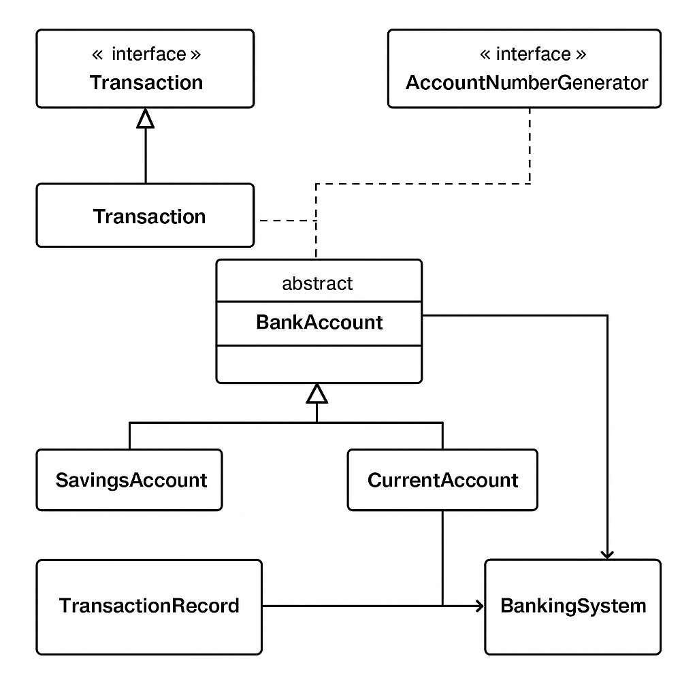

# 🏦 Banking System (Object-Oriented Java Project)



## Table of Contents
1. [About](#about)
2. [Features](#features)
3. [Class Diagram](#class-diagram)
4. [Getting Started](#getting-started)
5. [Usage](#usage)
6. [Package Structure](#package-structure)
7. [Detailed API Reference](#detailed-api-reference)
8. [Testing](#testing)
9. [Future Improvements](#future-improvements)
10. [License](#license)

---

## About
This project demonstrates how to build a **console-based banking application** using modern *Object-Oriented Programming* principles in Java. It showcases encapsulation, inheritance, polymorphism, abstraction, interfaces, custom exceptions, and basic data persistence via serialization.

> **Goal:** Provide a realistic yet lightweight code base that can be extended for classroom assignments, technical interview demos, or self-study.

---

## Features
| Category | Capability |
|----------|------------|
| Account Management | • Create Savings or Current account  
• Automatic, thread-safe account number generation  
• View account profile |
| Transactions | • Deposit & Withdraw with validation  
• View last *n* transactions  
• Daily withdrawal limit enforcement |
| Interest & Overdraft | • Monthly interest accrual for Savings  
• Configurable overdraft limit for Current |
| Security | • Simple PIN-based authentication  
• Input sanitation & error handling |
| Persistence | • Optional file-based serialization for accounts & history |
| Extensibility | • Interface-driven design, custom exceptions, clear separation of concerns |

---

## Class Diagram
A high-level UML diagram of the system is provided above. It highlights class relationships, interfaces, and key attributes.

---

## Getting Started
```bash
# 1. Clone repository
$ git clone https://github.com/your-handle/banking-system.git
$ cd banking-system

# 2. Compile
$ javac -d bin $(find src -name "*.java")

# 3. Run
$ java -cp bin com.bank.app.BankingSystem
```

**Prerequisites**
- JDK 11 or higher
- (Optional) Maven ≥ 3.6 for dependency management

---

## Usage
Upon launch you will see a numbered menu similar to:
```
=== BANKING SYSTEM ===
1. Create Account
2. Login to Existing Account
3. Exit
```
After logging in:
```
--- Welcome John Doe (SAV-1001) ---
1. Deposit
2. Withdraw
3. Show Balance
4. Show Transactions
5. Logout
```
Follow on-screen prompts. All invalid inputs trigger descriptive error messages.

---

## Package Structure
```
com.bank
 ├─ app
 │   └─ BankingSystem.java          (main driver)
 ├─ core
 │   ├─ Bank.java                   (bank façade)
 │   ├─ Transaction.java            (functional interface)
 │   ├─ AccountNumberGenerator.java (functional interface)
 │   ├─ BankAccount.java            (abstract base class)
 │   ├─ SavingsAccount.java         (concrete subclass)
 │   ├─ CurrentAccount.java         (concrete subclass)
 │   └─ TransactionRecord.java      (immutable POJO)
 └─ exception
     ├─ AccountNotFoundException.java
     ├─ AuthenticationException.java
     └─ InsufficientFundsException.java
```

---

## Detailed API Reference
### 1. `Transaction` (Functional Interface)
| Signature | Description |
|-----------|-------------|
| `void execute(double amount)` | Generic contract for deposit & withdraw methods. |

### 2. `AccountNumberGenerator` (Functional Interface)
| Signature | Description |
|-----------|-------------|
| `String next()` | Supplies unique, thread-safe account numbers. Default impl uses `AtomicLong`. |

### 3. `abstract class BankAccount implements Transaction`
| Modifier | Field | Type | Description |
|----------|-------|------|-------------|
| `private` | `String accountNumber` | `String` | Unique ID (e.g., SAV-1001). |
| `private` | `String holderName` | `String` | Customer full name. |
| `private` | `double balance` | `double` | Current account balance. |
| `private` | `List<TransactionRecord> history` | `List` | Chronological transaction list. |
| `protected static` | `double DAILY_WITHDRAWAL_LIMIT` | `double` | Enforced per account type. |

| Constructor |
|-------------|
| `BankAccount(String num, String name, double initBal)` |

| Public Methods | Return | Description |
|---------------|--------|-------------|
| `void deposit(double amt)` | `void` | Adds `amt` if positive; logs record. |
| `void withdraw(double amt)` | `void` | Overridden to apply specific rules. |
| `double getBalance()` | `double` | Current balance. |
| `String getAccountNumber()` | `String` | ID accessor. |
| `String getHolderName()` | `String` | Name accessor. |
| `List<TransactionRecord> getRecent(int n)` | `List` | Last *n* transactions (immutable copy). |

| Protected Methods | Description |
|-------------------|-------------|
| `void addRecord(String type, double amt)` | Utility to append to history. |

### 4. `class SavingsAccount extends BankAccount`
| Additional Field | Type | Purpose |
|------------------|------|---------|
| `private static double ANNUAL_INTEREST_RATE` | `double` | e.g., 4% p.a. |

| Overridden & New Methods |
|--------------------------|
| `void withdraw(double amt)` – checks daily limit & balance. |
| `void applyMonthlyInterest()` – credits interest monthly. |

### 5. `class CurrentAccount extends BankAccount`
| Additional Field | Type | Purpose |
|------------------|------|---------|
| `private double overdraftLimit` | `double` | Negative balance allowed. |

| Overridden Methods |
|--------------------|
| `void withdraw(double amt)` – allows overdraft up to limit. |

### 6. `record TransactionRecord(LocalDateTime timestamp, String type, double amount, double postBalance)`
An immutable Java 17 record capturing each transaction atomically.

### 7. `class Bank`
Facade responsible for account lifecycle.

| Method | Return | Description |
|--------|--------|-------------|
| `Bank(AccountNumberGenerator gen)` | — | Injects ID strategy. |
| `BankAccount createAccount(String type, String name, double initBal, String pin)` | `BankAccount` | Factory for Savings or Current. |
| `BankAccount login(String accNum, String pin)` | `BankAccount` | Authenticates user. |
| `void save(String file)` | `void` | Serializes state. |
| `void load(String file)` | `void` | Deserializes state. |

### 8. `class BankingSystem`
Contains `public static void main(String[] args)`; handles all console I/O, keeps UI separate from business logic.

### 9. Custom Exceptions
| Class | Thrown When |
|-------|-------------|
| `AccountNotFoundException` | Account number not present. |
| `AuthenticationException` | Wrong PIN. |
| `InsufficientFundsException` | Withdrawal exceeds balance/limit. |

---

## Testing
Unit tests (JUnit 5) reside under `src/test/java`.
```bash
mvn test   # if using Maven
```

---

## Future Improvements
- Switch to JDBC or JPA for persistent storage.
- Replace console UI with JavaFX or Spring MVC REST API.
- Add transaction reversal & audit logging.
- Integrate Maven/Gradle build profiles.

---

## License
This project is released under the MIT License ‑ see `LICENSE` for details.
